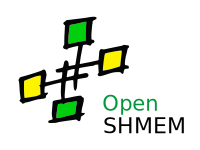
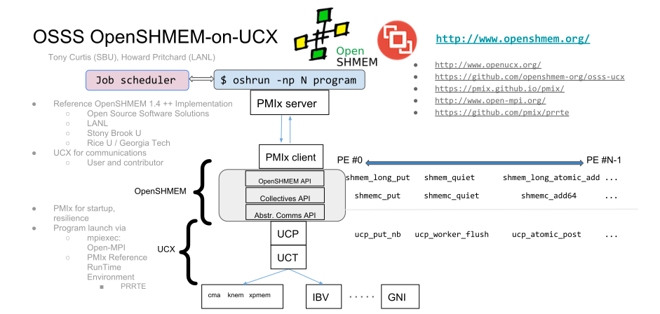

---

# OSSS-UCX

This project is the Open Source Software Solutions (OSSS) OpenSHMEM
Implementation on top of OpenUCX (UCX) and PMIx.

## Our Community

* [Project Website](http://www.openshmem.org/)
* [Github](http://www.github.com/openshmem-org/)
* [Mailing List](http://openshmem.org/mailman/listinfo/openshmem-list)

## Software Architecture

## Download Links

| Software | Link |
| :------- | :--- |
| OpenSHMEM | [https://github.com/openshmem-org/osss-ucx/](https://github.com/openshmem-org/osss-ucx/) |
| OpenUCX   | [http://www.openucx.org/](http://www.openucx.org/) |
| PMIx      | [https://github.com/openpmix/openpmix](https://github.com/openpmix/openpmix) |
| PRRTE     | [https://github.com/openpmix/prrte](https://github.com/openpmix/prrte) |
| Open-MPI  | [http://www.open-mpi.org/](http://www.open-mpi.org/) |

## License

See the [license file](./LICENSE).

## Building and Running

* [Building](./doc/building.md)
* [Running](./doc/running.md)
